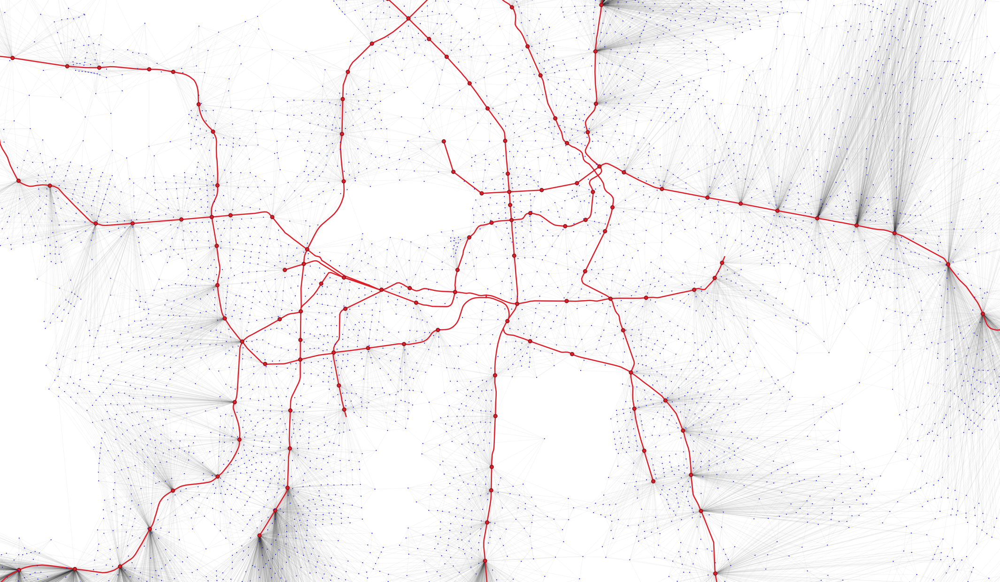

# TTMATRIX 
Toolkit for computing simple public transit travel time matrices

(c) Gabriel M. Ahlfeldt, version 0.1.0., 2025-05

# About

This repository provides a ready-to-use `Python` toolkit for computing simple **public transport travel time matrices**. It is designed to be **fast**, **convenient**, and **minimalist**, requiring only two input shapefiles:

1. **Points** to be connected (e.g. centroids of spatial units),
2. **Network geometry** (e.g. highways, subway lines). and, 
3. optionally, **public transport stations** (e.g. subway stops)

## Key Features

- **Customizable speeds**: Choose walking and transit speeds (e.g. 4 km/h and 35 km/h).
- **Smart routing**: Computes least-time routes for all origin-destination pairs, using the network **only if faster** than walking.
- **Flexible station choice**: No fixed assignment to nearest station — the toolkit chooses the most time-efficient entry and exit.
- **Automated station generation**: If no stations are provided, the toolkit generates artificial entry-exit points
- **Automatic snapping and connections**: Stations are snapped to the network, endpoints of network segments are snapped to each other, and all points are connected to nearest stations automatically.
- **Output**: 
  - Travel time matrix (`.csv`) where travel times are measured in minutes
  - Enriched shapefile with mean travel times per point
  - Optional visualization of travel time map

## Getting Started

If you are **new to Python**, you can download the Anaconda distrbution from [this website](https://www.anaconda.com/download). Open the script `TTMATRIX.py` in Spyder (Scientific Python Development Environment), an open-source integrated development environment (IDE) specifically designed for scientific computing and data analysis using Python. Of course, you can also use any other IDE. When executing `TTMATRIX.py` all dependencies are installed automatically if missing. The script can be copied and run from any folder on your machine. The chosen directory must contain a subfolder **Input** containing the three input shapefiles and a subfolder **Outputs** where the outputs will be saved. 

You can specify all relevant parameters in the below part of the code. There is no need to make any adjustments elsewhere.

```python
# === USER SETTINGS ===
working_dir = r"H:\Research\TTMATRIX-toolkit"       # Set your working directory
points_file = "B4m_com_ll.shp"                      # Point shapefile (origins/destinations)
stations_file = None                                # Set to None or "" to auto-generate stations
network_file = "UBahn2020_lines_ll.shp"             # Network polyline shapefile
point_id_field = "STAT_BLOCK"                       # Identifier field in point shapefile
walking_speed_kmh = 4                               # Walking speed (km/h)
network_speed_kmh = 35                              # Network speed (km/h)
snap_tolerance_m = 1.0                              # Tolerance for snapping network segment endpoints (meters)
output_matrix_file = "TTMATRIX-noSt.csv"            # Output travel time matrix CSV
output_shapefile = "ATT-noSt.shp"                   # Output shapefile with average travel times
output_edges_shapefile = "graph_edges-noSt.shp"     # Output shapefile showing the graph (network + walking) used in Dijkstra
# --- Only relevant if no station shapefile is progided ---
cluster_eps_m = 200                                 # Max distance between points in a cluster for artificial stations (meters)
# --- Optional for debugging ---
debug_limit_points = None                           # Set to e.g. 1000 to limit to first N points for testing
```

### Things to note

- The input shapefiles can use projection in projected meter units or decimal degrees (WGS1984). But they should all be in the **same projection**.
- The algorithm does not distinguish between lines on a network. It is assumed that riders can enter and exit the network at any station. If lines are not split at stations this will be done by the algorithm.
- If two lines cross without being split and snapped at a node, the algorithm will only allow for a change of line if the lines cross at a station. In this case, the algorithm will split and snap the lines. If two lines cross elsewhere (without split and snap), the algorithm will assume that a change of line is not intended.

## Content

Folder | File  | Description |
|:------------------------|:-----------------------|:----------------------------------------------------------------------------------|
| - | `TTMATRIX.py` | `Python` script to be executed after making the appropriate adjustments to the user settings.  |
| Input |- | Folder containing the input shapefiles to be provided by the user.   |
| Input | `B4m_com_ll.*` | Shapefile containing statistical blocks in Berlin projected in WGS1984 serving as locations to be connected in the exemplary application. To be replaced with a shapefile provided by the used. Make sure to update the name in the user settings. |
| Input | `UBahn2020_lines_ll.*` | Shapefile containing subway stations in Berlin projected in WGS1984. To be replaced with a shapefile provided by the used. Make sure to update the name in the user settings. |
| Input | `UBahn2020_lines_ll.*` | Shapefile containing subway lines in Berlin projected in WGS1984. To be replaced with a shapefile provided by the used. Make sure to update the name in the user settings.  |
| Output | - | Folder containing the outputs generated by the toolkit, in particular the travel time matrix.  |


## Methodology: Routing and Graph Construction

The travel time matrix is computed by constructing an **augmented graph** that combines the **public transport network** with **walking access**. The graph is undirected and weighted by travel times in minutes. The following nodes and edges are included:

### 1. Transit Network Edges
- Each transit line (e.g., a subway line) is decomposed into segments between consecutive coordinates.
- Each segment becomes an edge with a weight equal to the travel time:
time = (segment length in km) / (network speed in km/h) × 60

### 2. Station Nodes and Snapping Edges
- Each public transport station is added as a node.
- Each station is connected to its **nearest point** on the network via a **nearly zero-cost edge** (~0.0001 minutes) to allow entry and exit from the network.

### 3. Point Nodes and Access Edges
- Each point to be included in the travel time matrix is added as a node.
- Each point is connected to the **three nearest stations** by a walking edge, weighted by:
time = (Euclidean distance in km) / (walking speed in km/h) × 60


- This design allows the algorithm to determine the most efficient **entry and exit** stations for each journey — not just the nearest ones.

### 4. Direct Walking Edges Between Points
- To allow for walking-only trips, a walking edge is also added between any point and its **five nearest neighbors**.
- These are calculated the same way using walking speed and straight-line distance.

### 5. Shortest Path Computation
- The resulting graph allows both multimodal and walking-only routes.
- For each origin point, the shortest paths to all other points are computed using **Dijkstra’s algorithm**, weighted by travel time.
- The final travel time between any two points reflects the **least-cost route**, whether via transit or direct walking.

### Output
- A complete origin-destination travel time matrix (`.csv`)
- A shapefile enriched with each point’s **mean travel time**
- An optional map visualization of accessibility patterns

### Artificial Station Generation (when stations are not provided)

If no station shapefile is provided, the toolkit intelligently generates artificial station nodes based on the spatial distribution of the origin/destination points. This ensures a meaningful multimodal routing setup even in the absence of observed stations—particularly useful for scenarios such as modeling highway networks or potential infrastructure planning.

The generation follows these steps:

1. **Clustering of Points**:
   - All input points are clustered using the `DBSCAN` algorithm from `scikit-learn`.
   - The clustering uses Euclidean distance with a maximum radius of `cluster_eps_m` meters to define neighborhood groups.
   - Each cluster represents a potential service area for an artificial station.

2. **Station Placement**:
   - For each cluster, the geometric mean of the point coordinates is calculated to determine the cluster centroid.
   - This centroid is then snapped to the nearest position on the network using projection/interpolation to ensure all stations are connected to the transit graph.

3. **Integration with Network**:
   - These generated stations are treated identically to real ones:
     - Connected to the nearest network node with a minimal time cost (virtually free transfer),
     - Linked to the three nearest points (origin/destination nodes) with walking-time edges.

This method allows the toolkit to maintain consistent logic for multimodal routing, even in the absence of explicitly provided station data, ensuring that travel time matrices remain meaningful in all use cases.

### Illustration

The graph below illustrates how the toolkit establishes connectivity. The small blue dots (origins/destinations), large red dots (stations), and red lines are the inputs provided by the user. The grey lines are created by the toolkit to generate connectivity between locations and locations as well as locations and stations. The fastest route between two blue dots is found through the combined network created by the thick red lines and the thin grey lines. 




---

*Developed for quick and practical applications in spatial analysis and urban transport research.*
